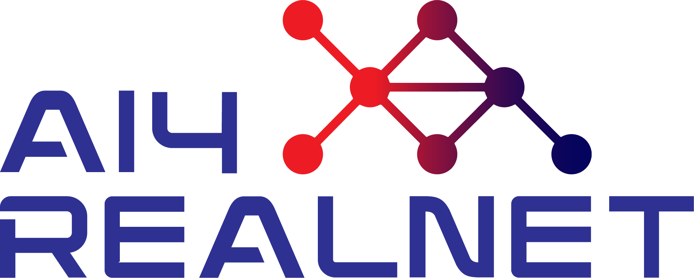

# A3S — Agent-as-a-Service

This repository implements the functionalities developed as part of Task 3.1 (Human-in-the-Loop) within the AI4REALNET project.

A standalone recommendation service: given a serialized environment state it
reconstructs that environment, asks an agent for candidate actions, and for each
candidate applies it and then follows the agent's policy for the next `n_steps`
timesteps — returning one recommendation per (candidate, timestep) with the KPIs
actually reached.

The core is environment-agnostic; each environment ships as a self-contained
integration. The one integration today is **PowerGrid** (Grid2Op), which speaks
the same HTTP API as the external RL agent (`T2.1_deep_expert`) InteractiveAI
calls by default, so it is a drop-in replacement for it.

Design, payload formats and how to add an environment:
[`docs/architecture.md`](docs/architecture.md).

## Supported By

| <a href="https://maze-rl.readthedocs.io/en/latest/">  </a> | <a href="https://www.enlite.ai/">  </a> | <a href="https://ai4realnet.eu">  </a> |
|:-------------------------------------------------------------------------------------------------------------------------------| -------------------------------------------------------------------------------------------------- |-----------------------------------------------------------------------------------------------:|


## InteractiveAI

InteractiveAI is the operator-facing UI and recommendation gateway that A3S serves:
it renders the simulator state and calls out to A3S (or the external RL agent) for
recommendations. This repo (`a3s-service/`) lives inside the InteractiveAI checkout,
which you get from [`github.com/ainetus/InteractiveAI`](https://github.com/ainetus/InteractiveAI) —
see that repo's own README for how to download and install it.

## Run it

A3S and InteractiveAI start independently, A3S first.

**1. Fetch the resources** (once per checkout — they are not committed):

```bash
cd a3s-service

# the agent code and assets live on the `docker` branch
git clone --branch docker https://github.com/ainetus/T2.1_deep_expert.git \
    resources/PowerGrid/T2.1_deep_expert

# no ready-made repo for these — copy them across as-is from
# https://github.com/IRT-SystemX/InteractiveAI/tree/main/usecases_examples/PowerGrid
#   config/CONFIG.toml                    -> resources/PowerGrid/PowerGridgrid2op_poc_simulator/CONFIG_POWERGRID.toml
#   Ressources/env_ICAPS_input_data_test  -> resources/PowerGrid/PowerGridgrid2op_poc_simulator/env_ICAPS_input_data_test
#   Ressources/XD_silly_repo              -> resources/PowerGrid/PowerGridgrid2op_poc_simulator/XD_silly_repo
```

The result must look like this:

```
resources/PowerGrid/
├── PowerGridgrid2op_poc_simulator/
│   ├── CONFIG_POWERGRID.toml        # env name, scenario, seeds
│   ├── env_ICAPS_input_data_test/   # Grid2Op env data + chronics
│   └── XD_silly_repo/submission/    # the `xd` agent
└── T2.1_deep_expert/                # the `t2.1` agent (default)
    ├── ExpertAgent/assets/whole_action_space.npz
    └── PPO_SB3/model/PPO_SB3.zip
```

Check it with:

```bash
./docker/check_agents.sh          # every agent; fails if none is usable
./docker/check_agents.sh t2.1     # just that one
```

It lists exactly which files are missing per agent. `local_setup.sh` runs the
same check on the agent you selected and refuses to build if it fails.

**2. Build and start A3S:**

```bash
./docker/local_setup.sh             # from a3s-service/
```

The first build pulls torch / Grid2Op / LightSim2Grid and takes a while;
afterwards unchanged sources rebuild in seconds. The script ends with the health
check and prints the URL InteractiveAI has to call:

```
  For InteractiveAI:  http://host.docker.internal:5010/api/v1/recommendation
```

**3. Start InteractiveAI against it**, from the repo root — pass that URL to
`--a3s`:

```bash

```bash
# on any other port, pass the URL the previous step printed
./local_setup.sh --a3s <ULR_from_previous_step> # e.g. http://host.docker.internal:6000/api/v1/recommendation
```

That points `cab_recommendation` at A3S and fails fast if nothing answers there.
It must be the `host.docker.internal` URL, not `localhost`: the recommendation
service calls it from inside its own container. Nothing in `.secrets` needs to
change — `--a3s` wins over `RL_AGENT_API_URL` for that run, and A3S needs no token.

`local_setup.sh` prints the login for the InteractiveAI UI and PowerGrid simulator
at the end: user `powergrid_user`, password `test`.

Without `--a3s`, InteractiveAI uses whatever `RL_AGENT_API_URL` in
`config/dev/cab-standalone/.secrets` says — by default the external RL agent.

**Stop:** `./docker/local_stop.sh` here, `./local_stop.sh` at the repo root.

### Options

```bash
./docker/local_setup.sh --port 6000   # publish on another host port (default 5010)
./docker/local_setup.sh --agent xd    # serve PowerGrid with the xd agent (default t2.1)
./docker/local_setup.sh --rebuild     # build from scratch, ignoring the cache
```

`A3S_PORT` and `A3S_POWERGRID_AGENT` do the same as env vars; the flags win.
Reach for `--rebuild` when the cache is lying to you: a changed base image or
pinned dependency, a half-finished earlier build, or a container still running
code you know you edited.

### Without the script

`local_setup.sh` is only these four commands plus the checks. Run them by hand if
you need to change one:

```bash
# 1. resources are in place
./docker/check_agents.sh t2.1

# 2. build
docker build --build-arg A3S_POWERGRID_AGENT=t2.1 -f docker/Dockerfile -t caba3s-local .

# 3. run (the container always listens on 5010; -p moves the host side)
docker run -d --name caba3s-local -p 5010:5010 \
  -e "FLASK_APP=app:create_app('dev')" \
  -e A3S_POWERGRID_AGENT=t2.1 \
  caba3s-local

# 4. health
curl localhost:5010/api/v1/health     # {"message": "Ok"}
```

Then either keep using `./local_setup.sh --a3s <url>` at the repo root, or set

```sh
export RL_AGENT_API_URL=http://host.docker.internal:5010/api/v1/recommendation
```

in `config/dev/cab-standalone/.secrets` and run `./local_setup.sh` without the flag.

If it does not come up: `docker logs caba3s-local`. Skipping step 1 is the usual
cause — a missing resource file surfaces on the first recommendation request, not
at startup, so the container looks healthy and the panel stays empty.

## API

```
GET  /api/v1/health
POST /api/v1/recommendation[?use_case=PowerGrid]
```

`use_case` defaults to `PowerGrid`, so callers that do not send it keep working.
Both the native state envelope and the legacy `T2.1_deep_expert` body are
accepted; the shapes are in `docs/architecture.md`.

## Configuration

| Variable | Default | Meaning |
| --- | --- | --- |
| `A3S_USE_CASES` | PowerGrid | Comma-separated `module:Class` use cases to load |
| `A3S_DEFAULT_USE_CASE` | `PowerGrid` | Use case for requests without `?use_case=` |
| `A3S_POWERGRID_AGENT` | `t2.1` | Policy serving PowerGrid: `t2.1` or `xd` (or `--agent`) |
| `A3S_T21_MODEL_PATH` / `A3S_T21_ACTION_SPACE_PATH` | vendored | T2.1 checkpoint + action list |
| `A3S_T21_ACT_TOP_K` / `A3S_T21_PROPOSE_SCAN_LIMIT` | 20 / 60 | T2.1 tuning |

Both PowerGrid policies ship in the image and neither loads anything until its
first request, so switching is one variable plus a restart. `xd` is the
`XD_silly_repo` assistant (full planner for the fan-out); `t2.1` is the
`T2.1_deep_expert` PPO policy (one forward pass, then simulation down its
ranking). An unknown value fails at startup. What that comparison is and is not
is spelled out in `docs/architecture.md`.

For the exact-reconstruction path, producer and A3S must agree on scenario and
seed, on the basename of the Grid2Op env data directory
(`env_ICAPS_input_data_test`), and on the pinned Grid2Op / LightSim2Grid
versions — see `docs/architecture.md`.

## Adding an agent

An agent is another policy for an environment A3S already serves. For PowerGrid:

1. Subclass `a3s_core.Agent` in `integrations/powergrid/agent_implementations/`:
   - `agent_type` — source label shown on the recommendation in InteractiveAI
   - `propose(observation, n_actions)` — the candidates offered to the operator
   - `act(observation)` — one action, used to play each candidate forward.
     Must always return something valid (a do-nothing is fine).

   The constructor gets the `PowerGridEnvironment`. Load models on the first
   call, not in `__init__`, so an unselected agent costs nothing. Copy from
   `xd_agent.py` or `t2_1_agent.py`; `simulation.py` has the shared what-if helpers.
2. Register it under a short name in `RECOMMENDATION_ENGINES` in
   `integrations/powergrid/use_case.py`.
3. Add that name to `AGENTS` and its files to `agent_requires` in
   `docker/check_agents.sh`. Without this `local_setup.sh --agent` rejects it.
4. Put its assets under `resources/PowerGrid/` and its dependencies in
   `pyproject.toml` (the image installs the base deps plus the `t2-1` extra).

Run it with `./docker/local_setup.sh --agent <name>`. Nothing changes on the
InteractiveAI side — same URL, same response shape.

## Adding an environment

A new environment is a new package next to `integrations/powergrid/`. Nothing in
`a3s_core/` or `api/` changes.

1. Subclass `a3s_core.Environment`: `prepare` (rebuild the state from the
   request envelope), `step`, `fork` (an independent copy per candidate),
   `kpis`, `timestep`, and `format_recommendation` (native action → the dict
   InteractiveAI renders).
2. Write at least one `Agent` for it, as above.
3. Subclass `a3s_core.EnvironmentUseCase`: give it a `name` and return the two
   from `build_environment()` / `build_agent()`. Override `validate_envelope` to
   reject payloads you can't read. `integrations/powergrid/use_case.py` is the
   whole example.
4. Load it via `A3S_USE_CASES`, e.g.
   `integrations.powergrid:PowerGridUseCase,integrations.myenv:MyEnvUseCase`.
   `local_setup.sh` doesn't pass this through, so add `-e A3S_USE_CASES=...`
   to its `docker run` or set it in the Dockerfile.

Callers pick the environment with `?use_case=<name>`; without it they get
`A3S_DEFAULT_USE_CASE` (or the first one loaded).

On the InteractiveAI side the environment needs its own use case (context,
event and recommendation managers, registered in
`resources/cabUsecases*/`). Its recommendation manager should POST to the A3S
URL with `?use_case=<name>` — the PowerGrid one in
`backend/recommendation-service/resources/PowerGrid/manager.py` does the same
call without the parameter. See InteractiveAI's own README for the rest.

More detail in [`docs/architecture.md`](docs/architecture.md#adding-an-environment).

## Tests

They need the Grid2Op stack, so run them inside the container:

```bash
docker exec caba3s-local python -m pytest tests -q
```

## Layout

| Path | Role |
| --- | --- |
| `a3s_core/` | Environment-agnostic core: contract, envelope, rollout, use-case registry |
| `integrations/powergrid/` | Grid2Op integration: environment, agents, formatting, KPIs |
| `api/` | HTTP layer: schemas, use-case resolution |
| `resources/PowerGrid/` | Grid2Op env + chronics, agent assets — not committed, see [Run it](#run-it) |
| `docs/` | Architecture |
| `docker/check_agents.sh` | Is an agent's `resources/PowerGrid/` layout complete? |


---

# Contacts

🌐 Website: [enlite.ai](https://www.enlite.ai/)
🔗 LinkedIn: [link](https://www.linkedin.com/company/enliteai)

---

# Acknowledgements

This work is partially supported by the **AI4REALNET** project, which has received funding from the European Union’s Horizon Europe Research and Innovation Programme under Grant Agreement No. **101119527**.
Views and opinions expressed are those of the author(s) only and do not necessarily reflect those of the European Union. Neither the European Union nor the granting authority can be held responsible for them.
