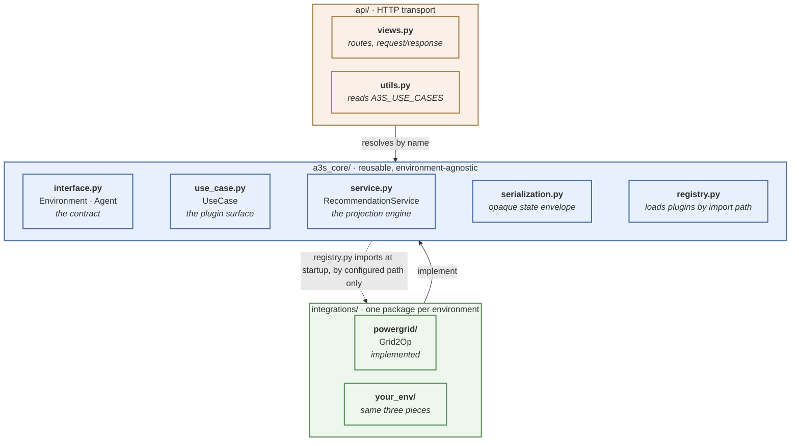
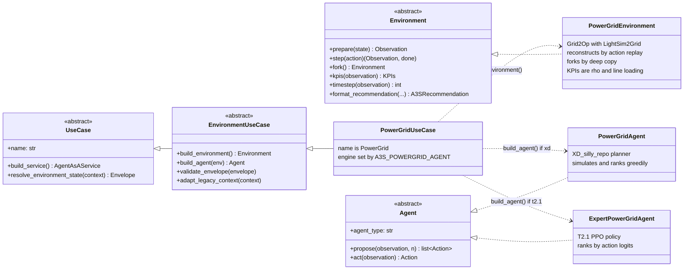
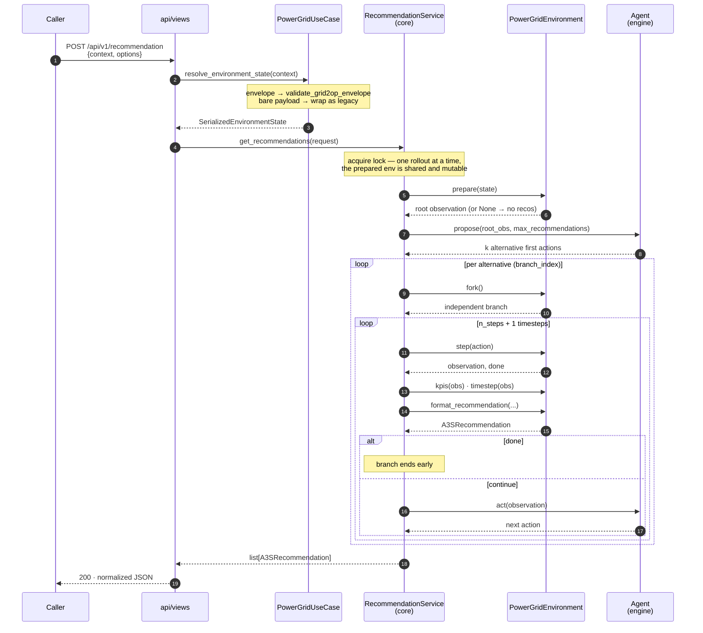
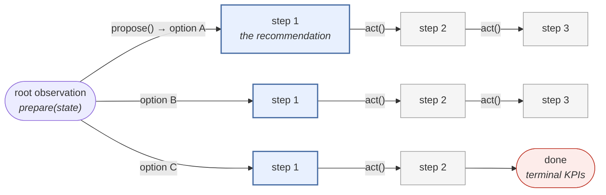
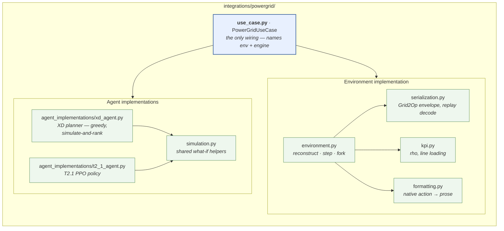
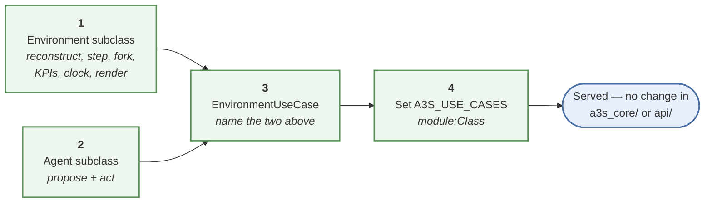

# A3S architecture

Agent-as-a-Service answers one question — *"given the state an operator is
looking at, what could they do, and how does each option play out?"* — and it
answers it the same way for every environment. That symmetry is the whole
design: the machinery for **projecting** a decision forward is generic, and
everything that makes a domain specific is pushed behind two interfaces.

The codebase therefore splits in two, with the dependency running one way only:



`a3s_core/` names no environment and imports nothing from `integrations/`. The
dotted arrow is the single, deliberate exception: `registry.py` imports whatever
`A3S_USE_CASES` names, by string, at startup — so the core reaches an
integration through configuration rather than through a source dependency.

## The contract

Three abstractions carry everything domain-specific. An integration supplies
concrete versions; the core is written against nothing else.



Why these three and not fewer:

| Abstraction | Answers | Why it can't live in the core |
| --- | --- | --- |
| `Environment` | *How do I reconstruct, advance and branch a world, and what is a KPI in it?* | Every simulator reconstructs differently, and picks a different cheap branching primitive — some are expensive to step but cheap to copy, others the reverse. |
| `Agent` | *Which actions are worth showing, and what would the policy do next?* | This is the recommendation engine — a planner, a trained policy, a rule set. Interchangeable even within one environment. |
| `UseCase` | *Which of the above, under what name, reading which payload shape?* | Wiring and payload dialects are deployment facts, so the HTTP layer stays free of them. |

## How a request flows

The engine never simulates or copies directly. It advances the world through
`step` and gets independent branches through `fork`, leaving each environment
free to implement those the cheap way.



### What the fan-out produces

`max_recommendations` sets the width, `n_steps` the depth. Each branch applies
one alternative, then follows the policy — so a branch spans `n_steps + 1`
timesteps, the first being the operator-facing option and the rest the
projection of what the agent would do after it.



Every emitted recommendation carries `branch_index` (which option) and `step`
(how far along that option), plus `env_timestep` — the environment's own
absolute clock, a different clock from `step`, so a projection can be placed on
a real timeline. A `done` step reports a *terminal* state, whose KPIs may be
degenerate and must not be read as ordinary values.

## What PowerGrid actually adds

The Grid2Op integration is the reference implementation of the contract above.
Everything in it is domain work; none of it is projection logic.



`PowerGridUseCase` is the whole of the integration's wiring, and it is
deliberately thin — a name, an environment, and a choice of engine:

```python
class PowerGridUseCase(EnvironmentUseCase):
    @property
    def name(self):
        return "PowerGrid"

    def build_environment(self):
        return PowerGridEnvironment()

    def build_agent(self, environment):
        # "xd" (default) or "t2.1", chosen by A3S_POWERGRID_AGENT
        return RECOMMENDATION_ENGINES[engine_name](environment)
```

The two engines are swapped by `A3S_POWERGRID_AGENT` and are otherwise
identical to the core — same environment, same projection, same response shape
— which is what makes them comparable on identical requests.

One thing worth naming: `adapt_legacy_context` wraps a bare Grid2Op observation
into the standard envelope, keeping the service a drop-in replacement for the
older T2.1_deep_expert API. That dialect detail never reaches the core or the
HTTP layer.

## Adding an environment



`A3S_USE_CASES` takes a comma-separated list, so one deployment can serve
several environments at once; callers select one with the `use_case` query
parameter, and `A3S_DEFAULT_USE_CASE` names the one that serves requests
omitting it (otherwise the first in the list). A malformed or unresolvable spec
fails at startup rather than silently serving nothing, so a typo stays
distinguishable from a deliberate configuration.

## Environment state and reconstruction fidelity

The environment is rebuilt from the serialized state the simulator publishes.
How close it gets depends on what the producer sends:

* **Exact** — the state carries the env's identity and its full `replay_actions`
  history. A3S seeds an identical env and replays that history, which also
  restores the hidden state an observation can't express (cooldowns, opponent
  budget, accumulated redispatch). This is what makes a multi-step projection
  trustworthy. The replayed prefix is cached, so a follow-up request from the
  same producer only steps the new actions.
* **Approximate** — no history, so the env is fast-forwarded through the
  chronics to the incoming timestep and the observation is overlaid. The hidden
  state is lost, so a projection drifts from what the simulator would reach.

For the exact path the producer and A3S must agree on scenario and seed (both
read them from their `CONFIG_*.toml`), on the basename of the Grid2Op env data
directory (`env_ICAPS_input_data_test`), and on the Grid2Op / LightSim2Grid
versions.
